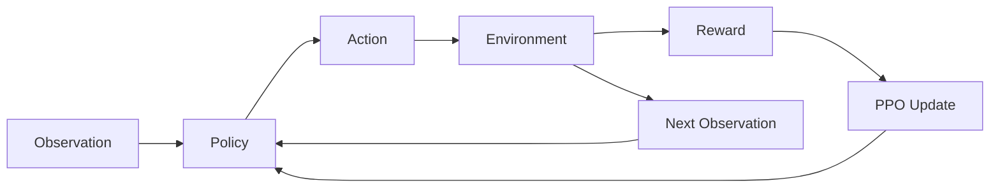

# 01 Overview — 全体像

このリポジトリの全体像は、次の4段階です。

```text
1. Random Policy
2. PPO Training
3. Evaluation
4. Video Recording
```

## 1. Random Policy

まず、学習していないランダムな方策で環境を動かします。

```bash
python scripts/random_policy.py --env-id CartPole-v1 --episodes 3
```

これは「Gymnasium の環境が正しく動くか」を確認するための作業です。

ランダム方策は、観測を見て賢く判断しているわけではありません。単にランダムに Left / Right を選んでいます。

## 2. PPO Training

次に PPO で方策を学習します。

```bash
python scripts/train_ppo.py --config configs/ppo.yaml
```

ここで起きていることは、以下です。

```text
環境を動かす
↓
観測・行動・報酬を集める
↓
どの行動が良かったかを推定する
↓
ニューラルネットワークの重みを更新する
↓
繰り返す
```

## 3. Evaluation

保存済みモデルを読み込み、学習済み方策の性能を確認します。

```bash
python scripts/evaluate.py \
  --env-id CartPole-v1 \
  --model-path outputs/ppo_cartpole.zip \
  --episodes 5
```

評価では、基本的に学習は行いません。

`model.predict()` により、現在の観測から行動を選ぶだけです。

## 4. Video Recording

最後に、学習済み方策の動きを動画として保存します。

```bash
python scripts/record_video.py \
  --env-id CartPole-v1 \
  --model-path outputs/ppo_cartpole.zip \
  --video-dir outputs/videos
```

動画生成は、学習の本体ではありません。

人間が結果を確認しやすくするための可視化です。

## 全体の概念図



## ソフトウェア構成

```text
Gymnasium
  環境を提供する

Stable-Baselines3
  PPO 実装を提供する

PyTorch
  ニューラルネットワークと自動微分を提供する

MoviePy / imageio / pygame など
  描画や動画保存を支える
```
